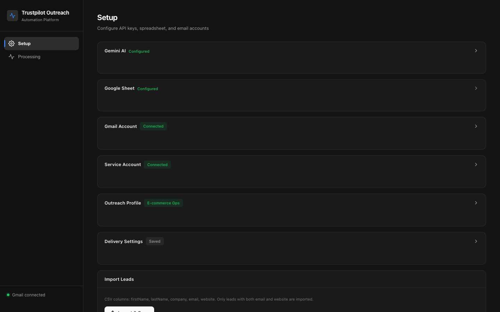
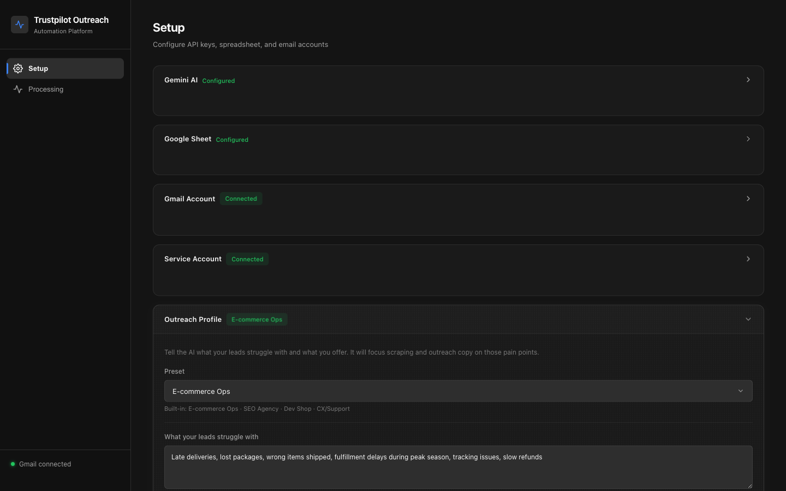
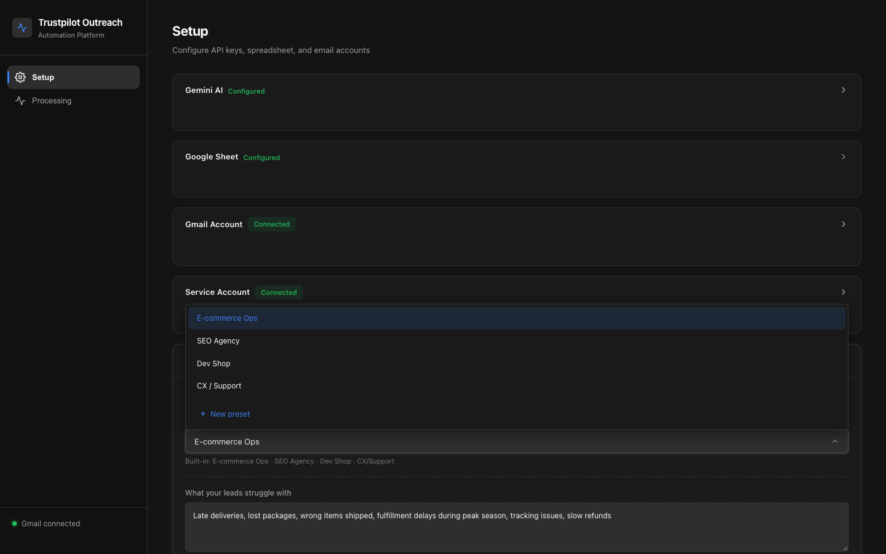
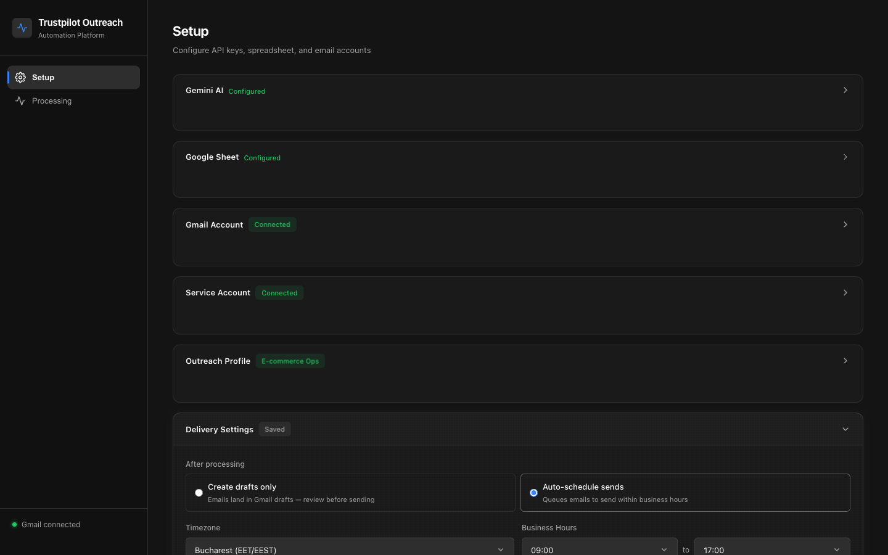
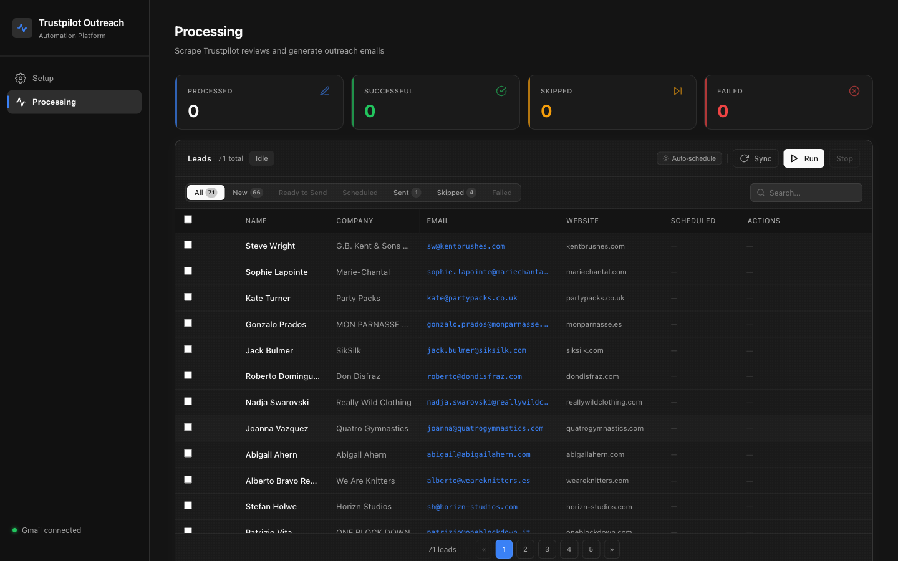

# Trustpilot Outreach Automation


Turn Trustpilot complaints into personalized cold emails — automatically.

This tool scrapes 1-2 star reviews for each lead, uses Gemini AI to identify operational pain points, and generates three A/B-tested email variants per lead. Drafts land directly in Gmail, optionally scheduled for delivery within configurable business hours.

**Built for:** Sales teams, agencies, and consultancies targeting companies with visible customer complaints on Trustpilot — across any industry.



---

## Table of Contents

- [How It Works](#how-it-works)
- [Tech Stack](#tech-stack)
- [Getting Started](#getting-started)
- [Walkthrough](#walkthrough)
  - [Setup Tab](#1-setup-tab)
  - [Outreach Profiles](#2-outreach-profiles)
  - [Delivery Settings](#3-delivery-settings)
  - [Processing Tab](#4-processing-tab)
- [Email Generation](#email-generation)
- [Scheduled Sending](#scheduled-sending)
- [Google Sheet Structure](#google-sheet-structure)
- [API Reference](#api-reference)
- [Project Structure](#project-structure)
- [Troubleshooting](#troubleshooting)

---

## How It Works

```
  Leads (CSV or Google Sheet)
           |
           v
  Trustpilot Scraper (Puppeteer)
  - Searches by website domain
  - Scrapes 1-2 star reviews (past 6 months)
           |
           v
  Gemini AI (gemini-2.5-flash)
  - Analyzes reviews through active Outreach Profile lens
  - Identifies pain points matching your service
  - Selects the most compelling customer quote
           |
           v
  Email Generator (3 A/B Variants)
  +----------------------------------+
  |  A: Direct Value                 |
  |  B: Curiosity Gap                |
  |  C: Peer Comparison              |
  +----------------------------------+
           |
           v
  Gmail Drafts  -->  Scheduled Send
                     (business hours, randomized intervals)
```

---

## Tech Stack

| Layer | Technology |
|---|---|
| Backend | Node.js + Express |
| Frontend | Vanilla JS single-page app (dark theme, shadcn palette) |
| Scraping | Puppeteer (headless Chromium) |
| AI | Google Gemini `gemini-2.5-flash` |
| Spreadsheet | Google Sheets API v4 (service account) |
| Email | Gmail API (OAuth2) |

---

## Getting Started

### 1. Clone and install

```bash
git clone https://github.com/dancolta/trustpilot-outreach-automation.git
cd trustpilot-outreach-automation
npm install
```

### 2. Get a Gemini API key

Go to [aistudio.google.com/apikey](https://aistudio.google.com/apikey) and create a key. You can enter it directly in the web UI.

### 3. Set up Google Cloud

1. Go to [console.cloud.google.com](https://console.cloud.google.com)
2. Enable **Google Sheets API** and **Gmail API**
3. **Service Account** (for Sheets):
   - IAM & Admin > Service Accounts > Create
   - Download JSON key > save as `credentials.json` in project root
   - Share your Google Sheet with the service account email
4. **OAuth 2.0 Client** (for Gmail):
   - Credentials > Create > OAuth 2.0 Client ID > **Desktop app**
   - Download JSON > save as `gmail-credentials.json` in project root

### 4. Start the server

```bash
npm run web
```

Open [http://localhost:3000](http://localhost:3000).

### 5. Complete setup in the UI

The Setup tab walks you through connecting each service. All settings persist to `settings.json` automatically.

---

## Walkthrough

### 1. Setup Tab

The Setup tab uses collapsible accordion panels for each integration. Status badges show connection state at a glance.


| Panel | Purpose |
|---|---|
| **Gemini AI** | Enter and live-test your API key |
| **Google Sheet** | Paste Sheet URL or ID; auto-formats headers on first connect |
| **Gmail Account** | OAuth2 connection with send-as alias support |
| **Service Account** | Displays the service account email for Sheet sharing |
| **Outreach Profile** | Configure what you sell and who you target (see below) |
| **Delivery Settings** | Control how and when emails are sent (see below) |
| **Import Leads** | CSV upload with append/replace modes and email deduplication |

---

### 2. Outreach Profiles

The Outreach Profile system makes the tool **universal** — it works for any business that helps companies with bad reviews, not just e-commerce.



Each profile defines:

- **Pain Points** — What your leads struggle with (guides which reviews the AI focuses on)
- **Offer** — One sentence about your service (frames the email CTA)
- **Tone** — Professional, Casual, or Direct
- **Review Focus** — Categories the AI prioritizes when analyzing reviews

#### Built-in Presets

Four presets ship out of the box. Select one and the fields auto-fill:



| Preset | Pain Points | Tone |
|---|---|---|
| **E-commerce Ops** | Late deliveries, lost packages, fulfillment delays | Casual |
| **SEO Agency** | Poor search rankings, bad online visibility | Professional |
| **Dev Shop** | Buggy checkout, slow pages, broken features | Direct |
| **CX / Support** | Terrible customer service, slow response times | Professional |

#### Custom Presets

Click **New preset** at the bottom of the dropdown to create your own. Custom presets are fully editable and deletable. Built-in presets cannot be deleted but can be used as a starting point.

---

### 3. Delivery Settings

Control when and how emails are delivered.



| Setting | Description |
|---|---|
| **Create drafts only** | Generates Gmail drafts for manual review — nothing is sent |
| **Auto-schedule sends** | Drafts are created and queued for delivery within business hours |
| **Timezone** | Your business timezone (used for scheduling windows) |
| **Start / End time** | Business hours window for sending |
| **Min / Max interval** | Randomized delay between sends (appears natural to spam filters) |

---

### 4. Processing Tab

The Processing tab is the operational hub — import leads, select targets, run the pipeline, and monitor results.



#### How to process leads

1. **Import** leads via CSV upload or Google Sheets sync
2. **Filter** using the status bar: All, New, Ready, Scheduled, Sent, Skipped, Failed
3. **Select** leads using checkboxes (individual, page, or all)
4. **Click Run** to start the pipeline

The pipeline runs through each selected lead:
- Searches Trustpilot for the company's review page
- Scrapes 1-2 star reviews from the past 6 months
- Generates 3 email variants using the active Outreach Profile
- Creates a Gmail draft (or auto-schedules delivery)

#### Status badges

| Status | Meaning |
|---|---|
| `New` | Imported, not yet processed |
| `Drafted` | Email generated, Gmail draft created |
| `Scheduled` | Draft created, send time queued |
| `Sent` | Email delivered |
| `Skipped` | No Trustpilot profile or no recent negative reviews |
| `Failed` | Error during scraping or generation |

---

## Email Generation

All three variants are generated in parallel using `gemini-2.5-flash`. Each targets a different conversion psychology, adapted to the active Outreach Profile.

### Variant A — Direct Value

Lead with the observed pattern, offer something specific.

> 12 delivery complaints in 60 days. Concentrated in Nov-Dec.
>
> ***"Ordered Nov 20, promised Nov 25. Nothing by Dec 4."***
>
> Peak season fulfillment. I've seen 3 specific fixes that cut this 70%.
>
> Want the breakdown?

### Variant B — Curiosity Gap

Create intrigue with a data-driven question.

> What changed between October (4.2) and December (1.8)?
>
> ***"Ordered Nov 20, promised Nov 25. Nothing by Dec 4."***
>
> 18 complaints mention Black Friday week specifically.
>
> Seeing the same pattern on your end?

### Variant C — Peer Comparison

Non-judgmental peer observation, collaborative tone.

> Noticed 18 delivery issues cluster around holiday weeks.
>
> ***"Ordered Nov 20, promised Nov 25. Nothing by Dec 4."***
>
> Same thing hit us during peak season — took 3 tries to get it right.
>
> What's your current approach during spikes?

### Email rules (all variants)

- Subject: 2-3 lowercase words (e.g. `delivery pattern`)
- Body: 50-85 words, sentences under 15 words
- One bold/italic customer quote
- CTA question on its own line
- No em dashes, no salesy language, peer-to-peer tone
- Includes your Gmail signature automatically

---

## Scheduled Sending

When **Auto-schedule sends** is enabled:

- Emails are queued within your configured business hours
- Randomized intervals between sends (default 15-25 min) to appear natural
- On server restart, scheduled emails are recovered automatically:
  - Future times re-queue normally
  - Past times within 7 days roll forward to the same clock time
  - Times older than 7 days are marked `Expired`

---

## Google Sheet Structure

### Sheet1 — Leads

| Column | Description |
|---|---|
| A — Status | Processing status (written by the tool) |
| B — First Name | Lead's first name |
| C — Last Name | Lead's last name |
| D — Company | Company name |
| E — Email | Lead's email address |
| F — Website | Company website (used to find Trustpilot profile) |

The sheet is auto-formatted on first connection: frozen header, column widths, dark header, alternating rows.

### Emails — Output

| Column | Description |
|---|---|
| Company | Company name |
| CEO Name | First name used in salutation |
| CEO Email | Destination email |
| Trustpilot URL | Scraped profile URL |
| Pain Points | Issues identified by Gemini |
| Email Draft (A/B/C) | Three generated variants |
| Status | Draft / Scheduled / Sent |
| Scheduled Time | Send time (if scheduled) |

---

## API Reference

| Method | Endpoint | Description |
|---|---|---|
| `GET` | `/api/settings` | Current config (API key masked) |
| `POST` | `/api/settings` | Save settings (Gemini key, Sheet ID, outreach profile, scheduling) |
| `DELETE` | `/api/settings/preset/:slug` | Delete a custom outreach preset |
| `POST` | `/api/settings/test-gemini` | Validate Gemini API key |
| `POST` | `/api/settings/test-sheet` | Validate Sheet connection |
| `POST` | `/api/settings/gmail-auth` | Start Gmail OAuth flow |
| `POST` | `/api/settings/gmail-disconnect` | Remove Gmail token |
| `GET` | `/api/settings/gmail-send-as` | List send-as addresses |
| `POST` | `/api/settings/send-from` | Set preferred send-from email |
| `GET` | `/api/leads` | All leads from Sheet1 |
| `POST` | `/api/import-leads` | CSV import (multipart, append/replace) |
| `POST` | `/api/start` | Start processing selected leads |
| `POST` | `/api/stop` | Stop the active job |
| `GET` | `/api/status` | Poll job progress and per-lead status |
| `POST` | `/api/redraft` | Regenerate email for a single lead |
| `POST` | `/api/send-now` | Immediately send a scheduled email |

---

## Project Structure

```
trustpilot-outreach-automation/
├── public/
│   └── index.html          # Single-page UI (dark theme, vanilla JS)
├── src/
│   ├── server.js            # Express API, job state, outreach profiles, scheduling
│   ├── emailGen.js          # Gemini AI email generation (V14, config-driven)
│   ├── gmail.js             # Gmail OAuth2, drafts, send-as aliases
│   ├── sheets.js            # Google Sheets read/write via service account
│   ├── trustpilot.js        # Puppeteer scraper for Trustpilot reviews
│   ├── index.js             # CLI entry point (batch mode, no web UI)
│   ├── draftEmails.js       # CLI: create Gmail drafts from Emails tab
│   ├── regenerate-emails.js # CLI: re-run email generation for a row
│   └── format-sheet.js      # CLI: re-apply Sheet1 formatting
├── screenshots/             # App screenshots for documentation
├── .env.example             # Environment variable template
└── package.json
```

---

## NPM Scripts

| Script | Description |
|---|---|
| `npm run web` | Start the web UI at http://localhost:3000 |
| `npm start` | CLI batch processor (no web UI) |
| `npm run format` | Re-apply Sheet1 formatting |
| `npm run regenerate` | Regenerate emails for a specific row |
| `npm run draft-emails` | Create Gmail drafts from the Emails tab |

---

## Troubleshooting

<details>
<summary><strong>"Skipped - No Trustpilot" for many leads</strong></summary>

The scraper searches by company website domain. If the domain doesn't match the Trustpilot profile URL, it won't be found. This is expected — not a failure.
</details>

<details>
<summary><strong>Timeout errors / "Failed" status</strong></summary>

Trustpilot pages can be slow. Process in smaller batches (5-10 leads), wait between batches, and avoid peak hours.
</details>

<details>
<summary><strong>Gmail OAuth won't complete</strong></summary>

Confirm `gmail-credentials.json` is in the project root and the OAuth client type is **Desktop app** (not Web). Allow the browser window through your firewall.
</details>

<details>
<summary><strong>Gemini API key invalid</strong></summary>

Verify at [aistudio.google.com](https://aistudio.google.com) and confirm `gemini-2.5-flash` is available in your region.
</details>

<details>
<summary><strong>Sheet connection fails</strong></summary>

The service account email (shown in Setup tab) must be added as an **Editor** on your Google Sheet.
</details>

<details>
<summary><strong>Scheduled emails not recovered after restart</strong></summary>

The server reads `Scheduled` status from the Emails tab on startup. Times older than 7 days are marked `Expired`.
</details>

<details>
<summary><strong>Rate limiting from Trustpilot (429)</strong></summary>

Reduce batch size to 3-5 leads and process during off-peak hours.
</details>

---

## Credentials (gitignored)

These files contain secrets and are excluded from version control:

```
.env                   # Environment variables
credentials.json       # Google service account key
gmail-credentials.json # Gmail OAuth client config
gmail-token.json       # Gmail OAuth token (auto-generated)
settings.json          # Persisted app settings
```

---

## License

ISC
