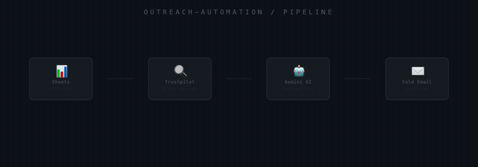
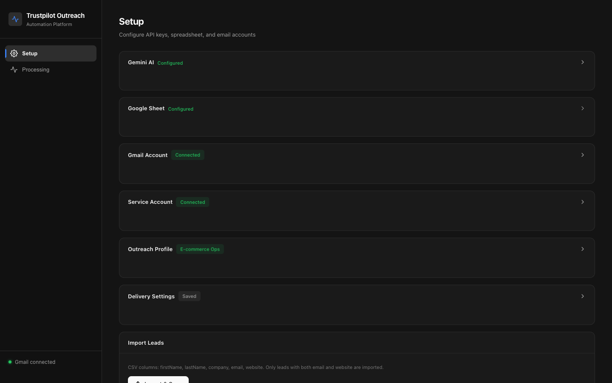
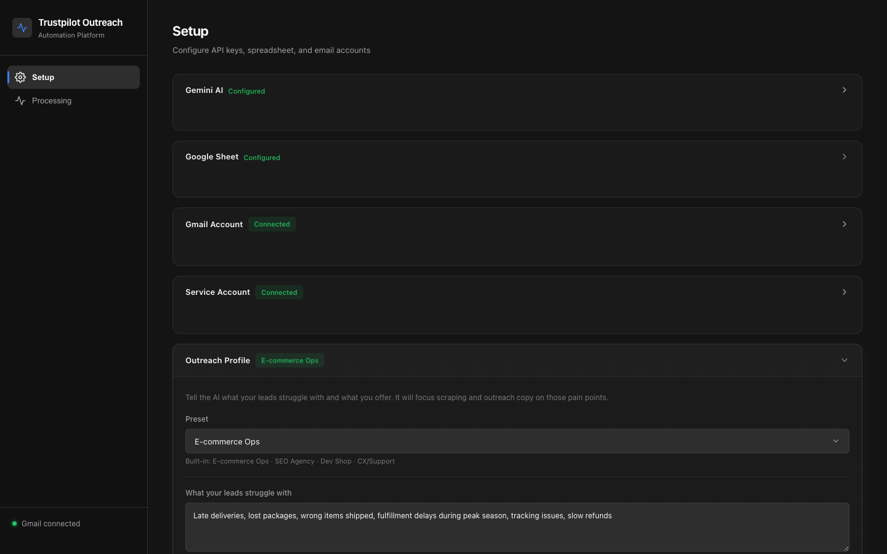
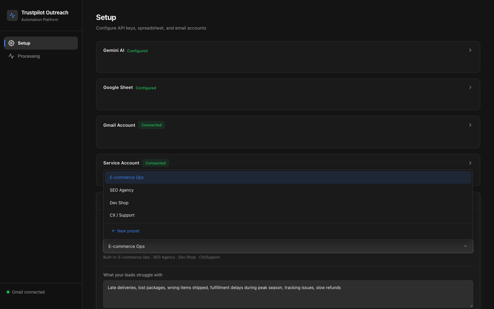
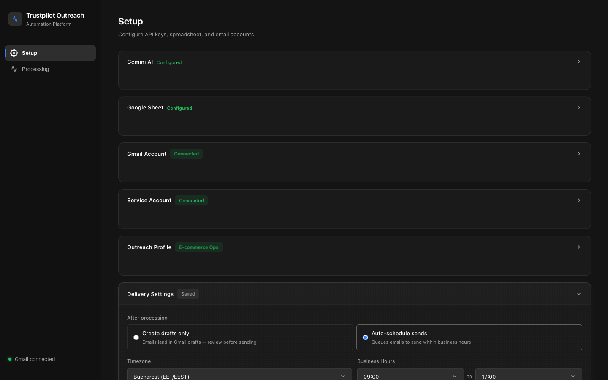
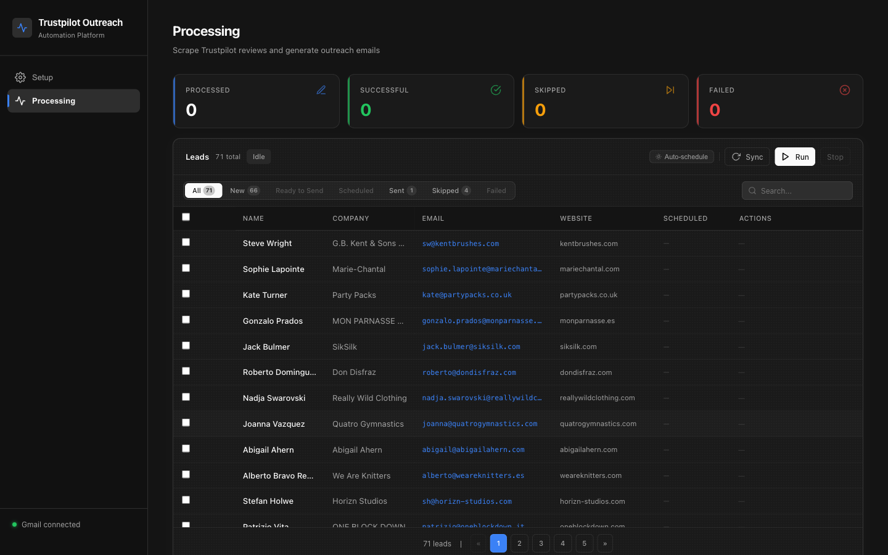

<div align="center">

# Turn competitor Trustpilot complaints into cold emails worth replying to

  

Open-source signal-based outbound for founder-led sales. Scrapes 1★/2★ Trustpilot reviews, drafts three personalized cold emails per lead with Gemini, and stages them in Gmail for you to read before anything sends.




</div>

> **What this is not:** Not a spray-and-pray sender. Not a paid intent-data vendor. Not an autonomous AI that emails strangers on your behalf. Drafts land in your Gmail. You ship.

---

## Why this exists

Cold outbound has two failure modes. You either pay Apollo, Instantly, or Smartlead a few hundred a month to blast scraped lists with `{{first_name}}` openers and watch your domain reputation cook — or you pay Clay $349 plus enrichment credits to do it more elegantly. Both assume the signal is the list. The list is not the signal.

A 1-star Trustpilot review is. Someone publicly raised their hand and said *the thing your service fixes is broken at this company right now*. That is intent data, free, timestamped, and written in the prospect's own words. The hard part has always been reading thousands of reviews, mapping them to your ICP, and writing the email. That's the part this automates — and only that part. You still hit send.

---

## How it works


Under the hood: Puppeteer scraper (public pages, rate-limited) → Gemini 2.5 Flash analyzes each review through your Outreach Profile lens → three email variants per lead (Direct Value, Curiosity Gap, Peer Comparison), each citing the actual reviewer quote → Gmail drafts. Scheduled send is opt-in with randomized intervals inside your configured business hours.

Three steps for the operator:

1. **Import leads** (CSV upload or Google Sheet sync). Each row is a company you'd consider a fit.
2. **Click Run.** The pipeline finds each company's Trustpilot page, scrapes recent negative reviews, generates three email variants per lead, and writes them as Gmail drafts.
3. **Open Gmail.** Read each draft. Keep, edit, delete, or send.

---

## What a draft actually looks like

Three variants, generated in parallel, each citing the prospect's own customer language. Example output for a fulfillment-issue lead:

**Variant A — Direct Value**

> Subject: delivery pattern
>
> 12 delivery complaints in 60 days. Concentrated in Nov–Dec.
>
> ***"Ordered Nov 20, promised Nov 25. Nothing by Dec 4."***
>
> Peak season fulfillment. I've seen 3 specific fixes that cut this 70%.
>
> Want the breakdown?

Variants B and C use the same review with a curiosity-gap and peer-comparison frame. Subjects stay lowercase, bodies stay under 85 words, no em dashes, no "I hope this finds you well." Your Gmail signature appends automatically.

---

## Quick start

```bash
git clone https://github.com/dancolta/trustpilot-outreach-automation.git
cd trustpilot-outreach-automation && npm install
npm run web
```

Then open [http://localhost:3000](http://localhost:3000). The Setup tab walks through the three things you need:

| Connection | Where to get it | What it costs |
|---|---|---|
| **Gemini API key** | [aistudio.google.com/apikey](https://aistudio.google.com/apikey) | Free tier covers most users. Roughly $0.0003 per draft on `gemini-2.5-flash`. |
| **Google Sheets** (service account) | [console.cloud.google.com](https://console.cloud.google.com) → Service Accounts → JSON key, saved as `credentials.json` | Free. |
| **Gmail OAuth** (desktop client) | Same console → OAuth 2.0 Client ID → **Desktop app**, saved as `gmail-credentials.json` | Free. |

No paid tiers. No telemetry. No CRM required.

---

## Outreach Profiles — the part that makes drafts not sound like AI

A generic "write a cold email about this review" call produces generic emails. An Outreach Profile is a lens — pain points you fix, the one sentence you'd use to describe your offer, your tone, the review categories you care about. The same negative review produces a different email depending on whose profile is active.

Four profiles ship out of the box. Edit any of them, or create your own.

| Preset | Pain it filters for | Tone |
|---|---|---|
| **E-commerce Ops** | Late deliveries, lost packages, fulfillment delays | Casual |
| **SEO Agency** | Poor search rankings, bad online visibility | Professional |
| **Dev Shop** | Buggy checkout, slow pages, broken features | Direct |
| **CX / Support** | Slow response times, ticket black holes | Professional |

The profile is the product. Spend an hour writing yours.

---

## How this compares

| | This repo | Apollo / Instantly / Smartlead | Clay | 6sense / Bombora | ChatGPT + manual |
|---|---|---|---|---|---|
| **Signal source** | Public 1–2★ reviews — real, dated complaints | Cold lists | Aggregated, paid | Paid intent data | None |
| **Personalization** | Cites the actual review | `{{first_name}}` token swap | Prompt-chained enrichment | Account-level only | Manual, slow |
| **Default behavior** | Drafts in Gmail. Human ships every send. | Auto-send pipelines | Auto-send | N/A | Manual |
| **Where data lives** | Your machine, your Google account | Vendor cloud | Vendor cloud | Vendor cloud | Local |
| **Cost** | $0 + ~cents/lead on Gemini | $97–500/mo per seat | $349+/mo | $40k+/yr | $20/mo + hours |
| **Setup** | Three commands | Sales call + onboarding | Workflow build | Procurement cycle | None — no leverage |

Closest cousins in OSS: [listmonk](https://github.com/knadh/listmonk) (self-hosted newsletter), [crawlee](https://github.com/apify/crawlee) (the scraping primitive). Neither does the signal→draft loop end-to-end.

---

## Deliverability and how this treats Trustpilot

**Deliverability.** Drafts mode is the default. When scheduled send is on, the queue uses randomized 15–25 minute intervals inside your configured business hours and tz, with daily overflow rather than burst sending. Everything routes through your own Gmail account using OAuth — no third-party SMTP relay, no shared IP pool, no warmup theater. Your domain reputation is yours.

**Trustpilot.** The scraper hits public review pages only. No auth bypass, no API misuse, no review-author PII beyond what's visible to any logged-out visitor. Rate-limited by default. Treat it the way you'd treat any read-only research tool: a few hundred companies a week is fine; ten thousand a day is not what this is for.

**Your responsibility.** Trustpilot's terms restrict scraping; Gmail's terms restrict automated sending and bulk behavior. This tool gives you the levers to stay inside both — drafts mode, business hours, randomized intervals, no auto-send. It does not absolve you of the call. If you put it on a server, blast 500 emails a day, and get suspended, that is on the operator, not the tool. Read the terms. Run it the way it's designed to be run.

---

## FAQ

**Is there a free open-source alternative to Apollo for cold email?**
This repo is a self-hosted Node.js alternative to Apollo, Instantly, Smartlead, and Lemlist for teams running founder-led sales. It uses Trustpilot 1–2★ reviews as a free, public buying-signal source, Gemini AI for personalization, and your own Gmail account for delivery. No subscription, no data-vendor lock-in.

**What is signal-based outbound?**
Signal-based outbound targets prospects who have demonstrated an active buying trigger — a public complaint about a competitor, a job change, a tech-stack switch — rather than blasting purchased lists. This tool operationalizes the simplest version: every negative Trustpilot review is a real-time signal, and the email writes itself around the reviewer's own words.

**Can I run AI cold email without paying for intent data?**
Yes. Public reviews are intent data. 1-star Trustpilot reviews are dated, attributed to a specific company, and written in the prospect's own pain vocabulary. That's exactly what 6sense and Bombora sell, except free and more specific.

**What does this actually cost to run?**
Roughly $0.0003 per generated draft on `gemini-2.5-flash` (so ~$0.30 per 1,000 drafts). Google Sheets and Gmail are free. Server cost is zero if you run it on your laptop.

**Is the scraper going to get my IP banned?**
Run it in normal-human volumes — a few hundred companies a week, not ten thousand a day. The defaults are conservative on purpose. If you 10× the batch size, expect rate-limit errors, and don't expect the tool to apologize for them.

**Will this 10× my reply rate?**
No. Two or three honest conversations a week with people who are actively unhappy with a direct competitor — that's the realistic outcome. This is leverage, not magic.

---

## Configuration and depth

<details>
<summary><strong>Full setup walkthrough (with screenshots)</strong></summary>

The Setup tab uses collapsible panels with live status indicators for each integration.



| Panel | What it does |
|---|---|
| Gemini AI | Enter and live-test your API key |
| Google Sheet | Paste a Sheet URL or ID; headers auto-format on first connect |
| Gmail Account | OAuth2 connection with send-as alias support |
| Service Account | Shows the address you need to share your Sheet with |
| Outreach Profile | Pain, offer, tone, review focus (see preset table above) |
| Delivery Settings | Drafts only / auto-schedule / timezone / send window / interval |
| Import Leads | CSV upload with append/replace modes and email dedupe |










</details>

<details>
<summary><strong>Google Sheet structure</strong></summary>

**Sheet1 — Leads**

| Column | Description |
|---|---|
| A — Status | Processing status (written by the tool) |
| B — First Name | Lead's first name |
| C — Last Name | Lead's last name |
| D — Company | Company name |
| E — Email | Lead's email address |
| F — Website | Company website (used to find the Trustpilot profile) |

The sheet is auto-formatted on first connection: frozen header, column widths, dark header, alternating rows.

**Emails — Output**

| Column | Description |
|---|---|
| Company | Company name |
| CEO Name | First name used in salutation |
| CEO Email | Destination email |
| Trustpilot URL | Scraped profile URL |
| Pain Points | Issues identified by Gemini |
| Email Draft (A/B/C) | Three generated variants |
| Status | Draft / Scheduled / Sent |
| Scheduled Time | Send time, if scheduled |

</details>

<details>
<summary><strong>API reference</strong></summary>

| Method | Endpoint | Description |
|---|---|---|
| `GET` | `/api/settings` | Current config (API key masked) |
| `POST` | `/api/settings` | Save settings (Gemini key, Sheet ID, outreach profile, scheduling) |
| `DELETE` | `/api/settings/preset/:slug` | Delete a custom outreach preset |
| `POST` | `/api/settings/test-gemini` | Validate Gemini API key |
| `POST` | `/api/settings/test-sheet` | Validate Sheet connection |
| `POST` | `/api/settings/gmail-auth` | Start Gmail OAuth flow |
| `POST` | `/api/settings/gmail-disconnect` | Remove Gmail token |
| `GET` | `/api/settings/gmail-send-as` | List send-as addresses |
| `POST` | `/api/settings/send-from` | Set preferred send-from email |
| `GET` | `/api/leads` | All leads from Sheet1 |
| `POST` | `/api/import-leads` | CSV import (multipart, append/replace) |
| `POST` | `/api/start` | Start processing selected leads |
| `POST` | `/api/stop` | Stop the active job |
| `GET` | `/api/status` | Poll job progress and per-lead status |
| `POST` | `/api/redraft` | Regenerate email for a single lead |
| `POST` | `/api/send-now` | Immediately send a scheduled email |

</details>

<details>
<summary><strong>Project structure</strong></summary>

```
trustpilot-outreach-automation/
├── public/
│   └── index.html                Single-page UI (dark theme, vanilla JS)
├── src/
│   ├── server.js                 Express API, job state, scheduling
│   ├── emailGen.js               Gemini email generation (config-driven)
│   ├── gmail.js                  Gmail OAuth2, drafts, send-as aliases
│   ├── sheets.js                 Google Sheets read/write (service account)
│   ├── trustpilot.js             Puppeteer scraper for Trustpilot reviews
│   ├── index.js                  CLI entry point (batch mode, no web UI)
│   ├── draftEmails.js            CLI: drafts from the Emails tab
│   ├── regenerate-emails.js      CLI: re-run generation for a row
│   └── format-sheet.js           CLI: re-apply Sheet1 formatting
├── screenshots/
└── package.json
```

NPM scripts:

| Script | Description |
|---|---|
| `npm run web` | Start the web UI at http://localhost:3000 |
| `npm start` | CLI batch processor (no web UI) |
| `npm run format` | Re-apply Sheet1 formatting |
| `npm run regenerate` | Regenerate emails for a specific row |
| `npm run draft-emails` | Create Gmail drafts from the Emails tab |

</details>

<details>
<summary><strong>Scheduled send recovery (on server restart)</strong></summary>

The server reads `Scheduled` status from the Emails tab on startup:

- Future send times re-queue normally.
- Past send times within 7 days roll forward to the same clock time.
- Times older than 7 days are marked `Expired`.

</details>

<details>
<summary><strong>Troubleshooting</strong></summary>

**"Skipped — No Trustpilot" for many leads.** The scraper searches by company website domain. If the domain doesn't match the Trustpilot profile, it won't be found. Expected, not a failure.

**Timeout errors / "Failed" status.** Trustpilot pages can be slow. Process in smaller batches (5–10 leads) and avoid peak hours.

**Gmail OAuth won't complete.** Confirm `gmail-credentials.json` is in the project root and the OAuth client type is **Desktop app**, not Web. Allow the browser callback through your firewall.

**Gemini API key invalid.** Verify at [aistudio.google.com](https://aistudio.google.com) and confirm `gemini-2.5-flash` is available in your region.

**Sheet connection fails.** The service account email (shown in the Setup tab) must be added as an **Editor** on your Google Sheet.

**Rate limiting from Trustpilot (429).** Reduce batch size to 3–5 leads and process during off-peak hours.

More cases in [TROUBLESHOOTING.md](TROUBLESHOOTING.md).

</details>

<details>
<summary><strong>Credentials (gitignored)</strong></summary>

These files contain secrets and are excluded from version control:

```
.env                     Environment variables
credentials.json         Google service account key
gmail-credentials.json   Gmail OAuth client config
gmail-token.json         Gmail OAuth token (auto-generated)
settings.json            Persisted app settings
```

</details>

---

## License

ISC. Use it, fork it, ship it. No warranty on the deliverability outcomes of your specific Gmail account.

## Contributing

Issues and PRs welcome. Keep changes scoped; this tool deliberately does not try to become a CRM.
